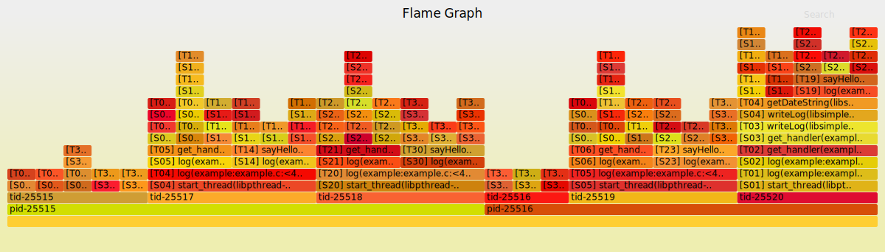
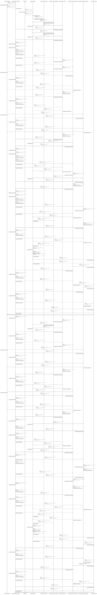
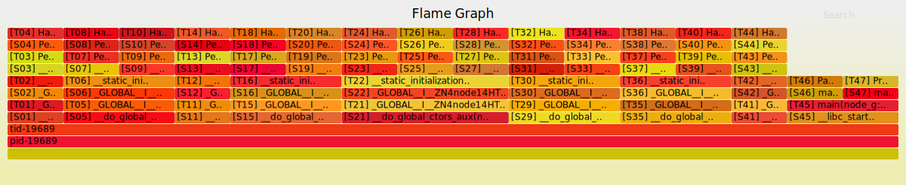
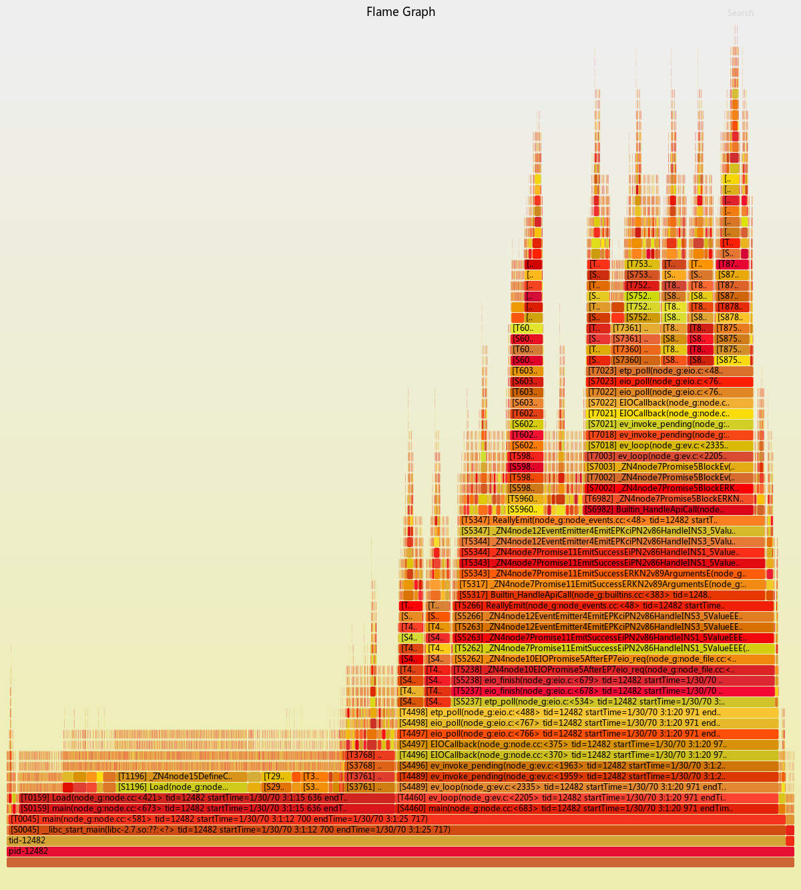
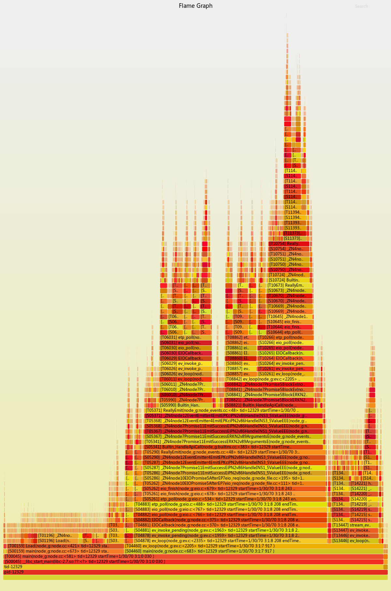
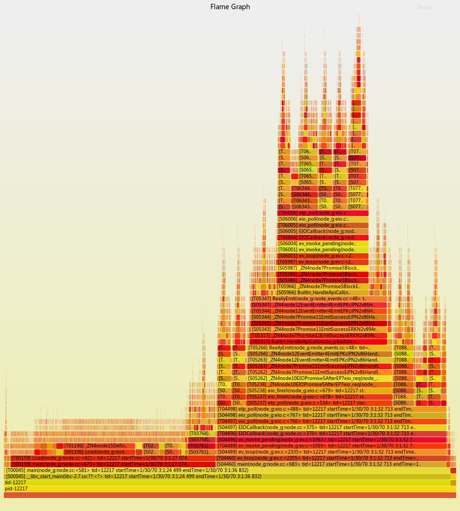

# CallTracer

`CallTracer` is an instrument toolkit, which can be linked into a C/C++ program as a shared lib, then record the program call stack traces, using the out-of-box utility command line tool to convert the call stack trace into various vitualizater, including: [seqdiag](http://blockdiag.com/en/seqdiag/), [diagrams](https://github.com/francoislaberge/diagrams) and [flamegraph](https://github.com/brendangregg/FlameGraph). 

It supports `exectuable ELF`, `static libraries`, `shared libraries` and `dynamic-loading libraries`. The primary goal for this tool is to provide a easy/firendly way for native(C/C++) program debugging. In practice, it also can act as an efficent utility tool to layout an overview of the program running details(function level call stack) in a straight-forward way.

Notable, turning on the func-trace will introduce significant performance impact,  please avoid using it on a production environment. 

## Prerequisite

- Linux OS (Tested on Ubuntu variants)

- Have `addr2line` command installed on your system

- Have `node.js` runtime on your environment

- Have `seqdiag` command installed if you want to generate seqdiag style sequencing diagram

## Examples

The sample is just used to demonstrate the usages of the tool. To make the sample cover mores situations, e.g: executable ELF, static-lib, and two kind of shared-libs, I am trying to split the sample into various modules with different lib types, this actually does not make any sense to a real-life program.


## How to run

The project is using GYP as the compile tool.

```sh
git clone https://github.com/leezhenghui/calltracer.git 
git submodule update --init

make clean
make 
make run-debug 

```

Using below command to conver the trace log into a visualizer view:

```
  ./tools/iseq/iseq

```

## Visualizer 

### FlameGraph (default)



### Seqdiag


### Diagrams 




## Waf

A WAF script is provided in this tool, which aim to enable the tool on a program using waf compiler framework, e.g: the early(initial) phase of node.js and node.js bindings implements. Here is some example flamegraph images, which I ever used for node v0.1.15(a quite old node.js impl based on waf, provides a very simple C/C++ binding extension, the event-loop is still running under libev and libeio) implementation debugging. Since the trace size a little bit large, I generate these diagrams by cutting down most of V8 trace points.

### Node.js v0.1.15 Init




### Node.js v0.1.15 HelloWorld Async-Binding 


### Node.js v0.1.15 HelloWorld Sync-Binding 



### Node.js v0.1.15 HelloWorld JS Http Server 



### Node.js v0.1.15 HelloWorld FS  



