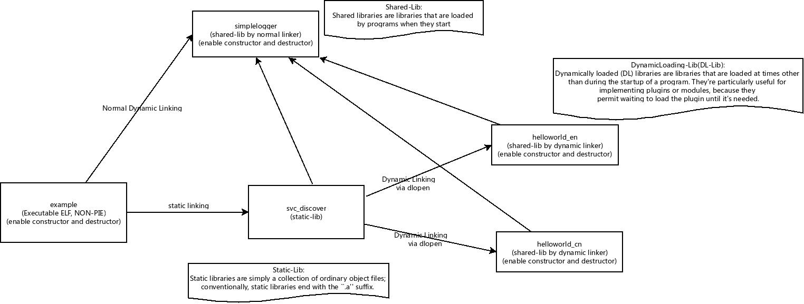
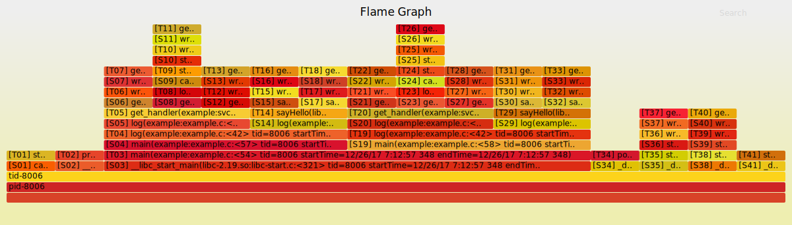

# CallTracer

`CallTracer` is an instrument tool, which is able to be linked to a C/C++ program via shared lib, then record the program call stack history, as well as show up the call stack via mutiples vitualization ways, including: seqdiag, diagrams and flamegraph. 

It provide a easy/friently way to for native program debugging or diving into a program to understand how it work under the hood.  

It supports exectuable ELF, static-lib, normal linker based  shared-lib and dynamic linker based shared-lib.

## Prerequisite

- Linux OS

- Have addr2line command installed on your system

- Have node.js runtime on your environment

## Examples

The sample is just used to demonstrate the usages of the tool. To make the sample cover mores situations, e.g: executable ELF, static-lib, and two kind of shared-libs, I am trying to split the sample into various modules with different lib types, this actually does not make any sense to a real-life program.




## How to run

The project is using GYP as the compile tool.

```sh
git clone https://github.com/leezhenghui/calltracer.git 
git submodule update --init

make clean
make 
make run-debug 

```

## Visualizer 

### FlameGraph (default)



### Seqdiag


### Diagrams 


