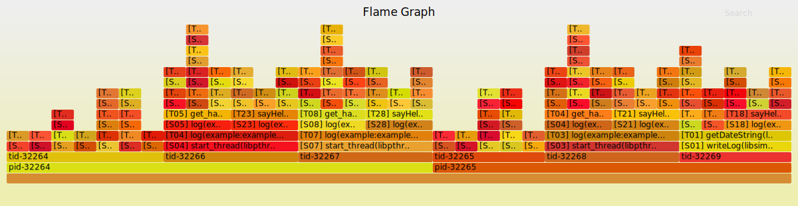

# CallTracer

[`CallTracer`](https://github.com/leezhenghui/calltracer) is an instrument toolkit and aimed to provide an easy way for native(C/C++) program debugging, in particular, it can work as an utility to record and layout the program execution details in various straight-forward representation ways.(e.g: sequencing diagram, flamegraph)

It is compiled as a shared lib and integrated into the C/C++ program to enable the tracer. Currently, it provides an user friendly integration for the builder `gyp` or `waf`, and use the out-of-box utility tool to convert the call stack into **file names** and **source code line**, finally be presented by a appropriate vitualizater, including: [seqdiag](http://blockdiag.com/en/seqdiag/), [diagrams](https://github.com/francoislaberge/diagrams) and [flamegraph](https://github.com/brendangregg/FlameGraph)(default). 

## Features

- Executable ELF (non-pie)

- Static library

- Dynamic linking library

- Dynamic loading library

- Tracing forked process

- Multiple threads

- Seqdiag

- Diagrams

- Flamegraph

>
> If you are familiar with [`flamegraph`](https://github.com/brendangregg/FlameGraph), you might know about it originally is used for sampling data and without an order guarantee. In the calltracer, the generated flamegraph are for tracer data, and we will ensure the call stack sequencing following the tracer generated order. 

Notable, turning on the func-trace will introduce significant performance impact,  please avoid using it on a production environment. 

## TODO

- Dynamic Tracer, enable/disable the tracer on-the-fly

- `dlclose` 

## Prerequisites for run the example

- Linux OS (Tested on Ubuntu variants)

- Have `addr2line` command installed on your system

- Have `node.js` runtime on your environment

- Have `seqdiag` command installed if you want to generate seqdiag style sequencing diagram

## Example

The sample is just used to demonstrate the usages of the tool. To make the sample cover mores situations, e.g: `executable ELF`, `static-lib`, `dynamic linking shared-lib`, `dynamic loading shared-lib`, `forked process` and `multiple-threads`, I am trying to split the sample into various modules with different lib types, this definitely does not make a sense in a real-life program.


## How to run

The project is using GYP as the compile tool.

```sh
git clone https://github.com/leezhenghui/calltracer.git 
git submodule update --init

make clean
make 
make run-debug 

```

Using below command to conver the trace log into a visualizer view:

```
  cd ./tools/iseq/ 
  npm install 
  ./tools/iseq/iseq

```

## Visualizer 

### FlameGraph (default)



>
> Open the original image and click(zoon in) the flame block you are interested in and get more detailed invocation information followed by that point, e.g: invocation seq, invocation occurs timestamp, file name and source code line. 


### Seqdiag


### Diagrams 


## Waf

A WAF script is provided in this tool, which aim to enable the tool on a program using waf compiler framework, e.g: the early(initial) phase of node.js and node.js bindings implements. Here is some example flamegraph images, which I ever used for node v0.1.15(a quite old node.js impl based on waf, provides a very simple C/C++ binding extension, the event-loop is still running under libev and libeio) implementation debugging. Since the trace size a little bit large, I generate these diagrams by cutting down most of V8 trace points.

### Node.js v0.1.15 Init


### Node.js v0.1.15 HelloWorld Async-Binding 


### Node.js v0.1.15 HelloWorld Sync-Binding 


### Node.js v0.1.15 HelloWorld JS Http Server 


### Node.js v0.1.15 HelloWorld FS  


